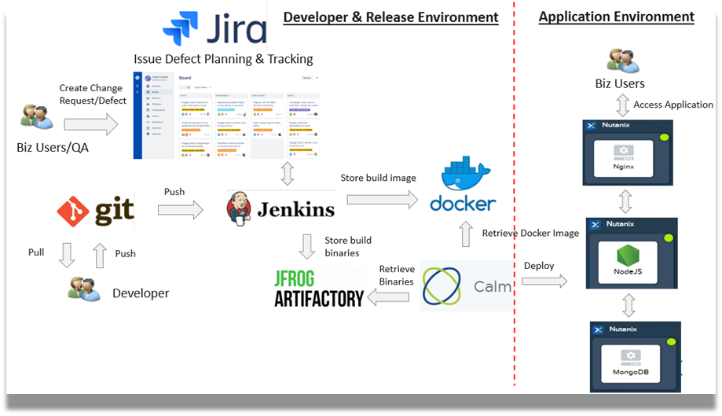

.. _calm_cicd:

-------------------------------------
Provision CI/CD environment with Calm
-------------------------------------

*The estimated time to complete this lab is 90 minutes.*

Overview
++++++++

Countless studies have shown that reducing the amount of time for developers to receive feedback on code changes improves software quality.  Automating the build, test, and deployment of software with tools such as Jenkins is one of the best ways to accelerate software development.  If you’re unfamiliar with Jenkins you can learn more on their website here_.

.. _here: https://www.cloudbees.com/jenkins/about

In this lab, we'll utilize Nutanix Calm to build the infrastructure required to create a Continuous Integration / Continuous Delivery (CI/CD) Pipeline, which includes deploying Jenkins, a Gitea_ git server, a developer workstation, and configuring that workstation.  Once the infrastructure is deployed via Nutanix Calm, we'll go through configuring Jenkins and Gitea to create a fully function CI/CD pipeline.  The end result will be a developer running a "git push", which triggers Jenkins to build a docker container based on the new code, publishes that container to private DockerHub registry, and then deploys the application

.. _Gitea: https://gitea.io/en-us/

Creating our CI/CD Infrastructure with Nutanix Calm
+++++++++++++++++++++++++++++++++++++++++++++++++++

Building a CI/CD pipeline generally involves connecting a large number of disparate tools.  To streamline this lab, we'll be deploying many of these tools via a Nutanix Calm blueprint.  We'll first launch the blueprint, and then in the ~20 minutes it takes to deploy, we'll cover the blueprint architecture to familiarze ourselves with the tools involved.

#. In **Prism Central**, select :fa:`bars` **> Services > Calm**.

#. Select **MarketPlace** in the left hand toolbar to view all the applications in the Market Place.  Select **Mountain Developer Environment**

   .. figure:: images/marketplace_CICD.png
       :align: center

#. Click **Launch**.

   .. figure:: images/MRP_Launch.png
       :align: center
       :alt: Nutanix Calm CI/CD Infrastructure Blueprint Launch 1

#. Select the Project and wait a few seconds to launch

  .. figure:: images/SelectProject.png

#.  On the launch page, fill in the following fields.

   - **Name of the Application** - *initials*-DEV_ENV_GP
   - **gitea_password** - Any password desired, which will be set as the Gitea admin user password
   - **karbon_cluster_name** - The name of the Karbon cluster to use for this lab (it **must** already be depoyed).  If the cluster was staged, leave the default of **karbon_bootcamp_cluster**.

   .. figure:: images/AppLaunch.png.png
       :align: center
       :alt: Nutanix Calm CI/CD Infrastructure Blueprint Launch 2

#. Click the blue **Create** button, and ensure you're redirected to the application page.

Now that we're waiting for our CI/CD Infrastructure to deploy, let's review the architecture of the blueprint.  

In approximate order (approximate as Calm deploys Services in parallel, unless there is a dependency), the blueprint deploys the following Services:

- **Gitolite** (AHV) - this Service installs Gitolite, which is a community managed lightweight code hosting solution.  It then creates self signed certificates, installs the Gitea service, and configures the repo which stores our application code.
- **Jenkins_Master** (AHV) - this Service installs Jenkins, a popular Continuous Integration server.  It also trusts Certificate Authority (CA) generated during the Package Install of the **Gitolite** Service.
- **Jenkins_Slave** (AHV) - this Service installs a Jenkins Slave, which is used for builds in our Jenkins pipeline.  Meaning this is the node that is responsible for building a docker container based on the new application code, publishing tha container to DockerHub, and then deploying the new application.
- **Docker Hub** - provision a private Docker Hub registry.
- **Workstation** (AHV) - this Service represents a "developer workstation," and is where we'll be making changes to our application code later in this lab.  It first installs necessary software (like *git*), and clones the git repo configured in the **Gitolite** Service.

Once your Jenkins_Master and Jenkins_Slave Services have been fully deployed, move on to the next section.

#.  This is the picture of successful launch.  

   .. figure:: images/Successful-Launch.png
       :align: center

Accessing Jenkins
+++++++++++++++++

Now that our CI/CD Infrastructure has been deployed, we're ready to start configuration of the various components that make up our Pipeline.  First up, is Jenkins.

#. Click on **Audit** tab of your application.  Expand on the **Create** and then **Developer Workstation Start**.  Note down the Jenkins Initial Authorization Password

   .. figure:: images/JenkinsAuthorization.png
       :align: center

#. Drill into the application.  Click on  **Services** tab of your Application.  Note down the Jenkins Master IP address

   .. figure:: images/05_app_overview.png
       :align: center
       :alt: Nutanix Calm CI/CD Infrastructure App Overview

#. Open a browser and access jenkins on http://<Jenkins Master IP address>:8080.  

   - **Username** - admin
   - **Password** - Jenkins Initial Authorization Password

   .. figure:: images/Jenkin_Login.png
       :align: center
   

#. Calm CI/CD Blueprint had provisioned the devops and devops_deploy pipeline.  Verify the 2 pipelines were created.

   - **devops** - Webhook with Gitolite and build the applications into Docker image and binaries.
   - **devops_deploy** - Triggered another Calm blueprint to deploy the application.

   .. figure:: images/Jenkins-Pipeline.png
       :align: center
  

#. Drill into the devops pipeline to view the steps configured for Continuous Integration.

   .. figure:: images/devops_pipeline.png
       :align: center
       

#. Drill into the devops_deploy pipeline to view the steps configured for Continuous Delivery

   .. figure:: images/devops_deploy.png
       :align: center

Accessing the Developer Workstation
+++++++++++++++++++++++++++++++++++

Throughout this entire lab, we'll be running a large number of commands from our developer workstation, as it has already been configured with all the necessary software packages and pointed at our git repository that's stored in Gitolite.

To access the developer workstation, you have two options: 1, use the web SSH client as we did for the Jenkins Service, or 2, use your laptop's terminal or PuTTY to SSH into the workstation.  Either option is perfectly valid, however we recommend you stick with whatever you're most comfortable with.  Since we already covered how to use the web SSH client in the previous step, we'll cover SSH'ing in from your laptop here.

#. Back in our Calm application page, navigate to the **Services** tab, and select the **Workstation** Service.  In the right column that appears, click on **Open Terminal**.

   .. figure:: images/12_copy_workstation_ip.png
       :align: center
       :alt: CI/CD Infrastructure App Copy Workstation IP

#. Navigate to the **devops/web/src/css/** directory on your workstation.  Run the following code to edit the style.css.  In style.css, press /databox and change it to **FF4394**.  Key in :wq to write the changes to the file.

   .. literalinclude:: edit-style.sh
       :language: bash

   .. figure:: images/style.png

#. Run the following commands to commit the change, and finally push the change to the Gitolite repository

    .. literalinclude:: git-commit.sh
       :language: bash

   .. figure:: images/gitcommit.png
       :align: center
       :alt: Git Commit

   .. figure:: images/gitpush.png
       :align: center
       :alt: Git Push

#. As soon as you run git push, you should see an automated build started in your Jenkins project.

   .. figure:: images/jenkins_build.png
       :align: center
       :alt: Jenkins Build

#. Navigate to Calm.  Navigate to Application.  It may take few mins to provision to reach **Running** state.

   .. figure:: images/calm_app_provision.png
       :align: center
       :alt: Calm Provision the Application

#. Navigate into Services.  Click on **Nginx**.  Identify the IP address

   .. figure:: images/MRP-APP.png
       :align: center
       :alt: Calm Provision the Application

#.  Finally, refresh our application page to view the updated message.

   .. figure:: images/MRPAPP.png
       :align: center
       :alt: Mountain Ranking Application

Takeaways
+++++++++

While setting up a CI/CD pipeline can be quite a bit of effort, the value it brings to your organization makes it well worth it.  Once configured, a simple git push -- an operation your developers likely run several times a day -- results in a brand new application, with minimal to no effort on your or the developers part.  